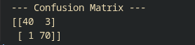

# Semana 1
_Conclusões retiradas atraves do estudo do dataset_

## Introdução ao código utilizado

Para a semana 1, é indicado que utilizemos um dataset de medidas retiradas de diagnósticos de cancro
da mama([link](https://archive.ics.uci.edu/ml/datasets/Breast+Cancer+Wisconsin+(Diagnostic))), este dataset contem **30** valores por diagnóstico que vamos analisar, escalar e utilizar para trainar um modelo de machine learning.

O código utilizado para retirar conclusões está exposto e descrito abaixo.
```py
data = load_breast_cancer()
X, y = data.data, data.target

df = pd.DataFrame(X, columns=data.feature_names)

pd.set_option('display.max_rows', None)
pd.set_option('display.max_columns', None)
```
Carregamos o nosso dataset e defenimos duas opções para que, ao fazer a descrição das colunas, nos mostre todas as colunas.
```py
df['target'] = y
print("--- Basic Statistics ---")
print(df.describe())
print("\n--- Class Distribution ---")
print(df['target'].value_counts())
```
Dividimos os dados, utilizamos o metodo **describe** na libraria pandas, que calcula automaticamente todas as estatisticas basicas necessarias para retirar conclusões de relevo de cada coluna.
```py
X_train, X_test, y_train, y_test = train_test_split(X, y, test_size=0.2, random_state=42)

scaler = StandardScaler()

X_train_scaled = scaler.fit_transform(X_train)

X_test_scaled = scaler.transform(X_test)
```
Começamos por utilizar o **train_test_split** para separar o nosso dataset em 80% estudo e 20% teste, esta linha é crucial pois precisamos sempre de ter os nossos dados de treino e teste, caso contrario não poderiamos corretamente avaliar o modelo.

**Escalar os dados? Porque?**

Quando tratamos de algoritmos, aprendemos que estes interagem com o nosso dataset de forma geometrica e ter grandes valores presentes em conjunto com valores baixos (relação de worst area com mean smoothness).


## A confusion matrix
A confusion matrix é a nossa guideline para perceber a performance do nosso modelo, neste caso a nossa confusion matriz é representada por uma matriz 2x2, visto que um tumor pode ser identificado como benigno ou maligno.



Temos os valores **40** e **3** na primeira linha, estes identificam os tumores identificados como benignos e mal-identificados como benignos, respetivamente. A linha inferior **1** e **70**, apresenta os mal-identificados como malignos e os malignos, respetimante.

**O problema critico com o dataset?**

Quando queremos treinar um modelo com um dataset, devemos fornecer, se possivel, um dataset equilibrado, no sentido em que, se o modelo interagir mais com exemplos de um caso pode desenvolver uma bias para esse mesmo caso. No nosso dataset, temos **357 benignos** e **212 malignos** (~67%/~33%), o que não é muito desiquilibrado, mas pode ser a razão dos 3 casos mal-identificados como negativos, o que seria o pior cenario para o nosso modelo.


## Que informação pode existir na imagem original que estas características não capturam?

As característicasextraídas assumem que a malignidade pode ser perfeitamente descrita pela geometria celular básica. No entanto, a imagem original contém fatores que escapam a estes 30 descritores, tais como:


**Heterogeneidade localizada**: Uma pequena área do tecido pode ter um padrão muito anómalo, mas esse detalhe pode ser diluído ao calcular a "média" ou não ser capturado pelos "piores" (worst) valores.

**Artefactos e inflamação**: A presença de células imunitárias em redor do tumor (um indicador clínico importante), áreas de necrose (tecido morto) ou calcificações irregulares que não são quantificadas nas features disponíveis.

**Textura complexa**: Embora exista uma feature de mean texture, a complexidade visual do grão da imagem, o contraste local e as micro-variações na coloração/intensidade do tecido são muito mais ricas na matriz de píxeis original do que num único número real.