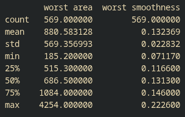
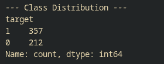
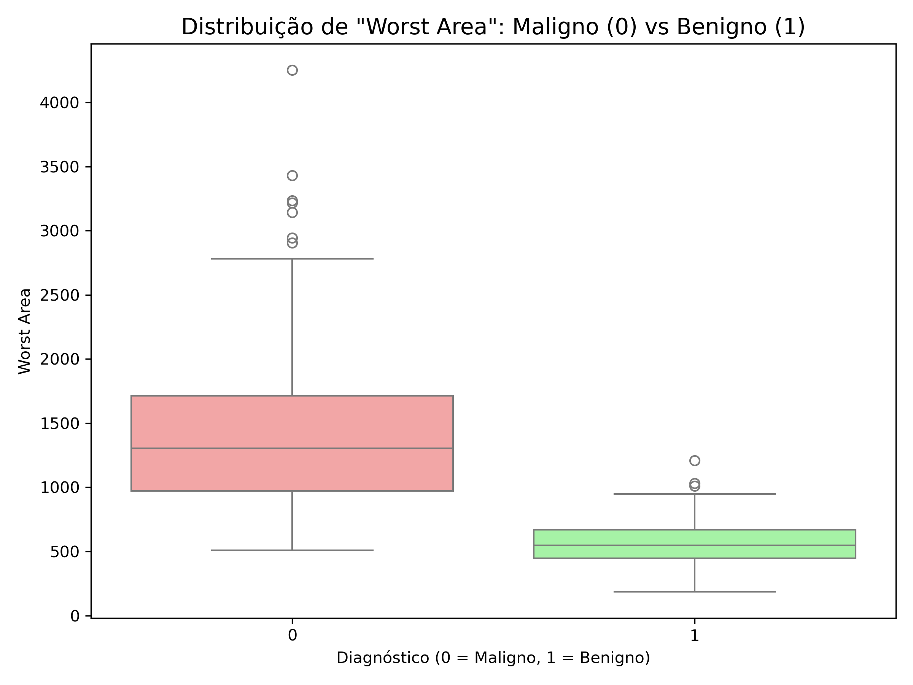

# Semana 1
_Conclusões retiradas através do estudo do dataset_

## Introdução ao código utilizado

Para a semana 1, é indicado que utilizemos um dataset de medidas retiradas de diagnósticos de cancro
da mama([link](https://archive.ics.uci.edu/ml/datasets/Breast+Cancer+Wisconsin+(Diagnostic)), este dataset contem **30** valores por diagnóstico que vamos analisar, escalar e utilizar para treinar um modelo de Machine Learning.

O código utilizado para retirar conclusões está exposto e descrito abaixo.

```py
data = load_breast_cancer()
X, y = data.data, data.target

df = pd.DataFrame(X, columns=data.feature_names)

pd.set_option('display.max_rows', None)
pd.set_option('display.max_columns', None)
```

Carregamos o nosso dataset e definimos duas opções para que, ao fazer a descrição das colunas, nos mostre todas as colunas.

```py
df['target'] = y
print("--- Basic Statistics ---")
print(df.describe())
print("\n--- Class Distribution ---")
print(df['target'].value_counts())
```

Dividimos os dados, utilizamos o método **descreve** na livraria pandas, que calcula automaticamente todas as estatísticas básicas necessárias para retirar conclusões de relevo de cada coluna.

```py
X_train, X_test, y_train, y_test = train_test_split(X, y, test_size=0.2, random_state=42)

scaler = StandardScaler()

X_train_scaled = scaler.fit_transform(X_train)

X_test_scaled = scaler.transform(X_test)

model = LogisticRegression(random_state=42, max_iter=1000)
model.fit(X_train_scaled, y_train)
```

**Escalar os dados? Porque?**

Quando tratamos de algoritmos, aprendemos que estes interagem com o nosso dataset de forma geométrica e ter grandes valores presentes em conjunto com valores baixos (relação de worst area com mean smoothness).



Começamos por utilizar o **train_test_split** para separar o nosso dataset em 80% estudo e 20% teste, esta linha é crucial, pois precisamos sempre de ter os nossos dados de treino e teste, caso contrario não poderíamos corretamente avaliar o modelo.

```py
print("\nA gerar gráficos de análise exploratória...")

plt.figure(figsize=(14, 12))
matriz_correlacao = df.corr()
sns.heatmap(matriz_correlacao, cmap='coolwarm', annot=False, fmt=".2f", linewidths=0.5)
plt.title('Matriz de Correlação - Breast Cancer Dataset', fontsize=16)
plt.tight_layout()
plt.savefig('heatmap_correlacao.png', dpi=300)
plt.close()

plt.figure(figsize=(8, 6))
sns.boxplot(x='target', y='worst area', hue='target', data=df, palette={0: '#ff9999', 1: '#99ff99'}, legend=False)
plt.title('Distribuição de "Worst Area": Maligno (0) vs Benigno (1)', fontsize=14)
plt.xlabel('Diagnóstico (0 = Maligno, 1 = Benigno)')
plt.ylabel('Worst Area')
plt.tight_layout()
plt.savefig('boxplot_worst_area.png', dpi=300)
plt.close()

```
Esta secção de código é responsavel por gerar o heatmap e o boxplot.

```py
y_pred = model.predict(X_test_scaled)
print("\n--- Confusion Matrix ---")
print(confusion_matrix(y_test, y_pred))
print("\n--- Classification Report ---")
print(classification_report(y_test, y_pred, target_names=['Malignant (0)', 'Benign (1)']))
```

Aqui corremos as previsões e temos acesso á **confusion matrix** e **classification report**, isto indica a nossa acuracy e os nossos resultados.Geramos tambem o nosso heatmap e box plot


## A confusion matrix
A confusion matrix é a nossa guideline para perceber a performance do nosso modelo, neste caso a nossa confusion matriz é representada por uma matriz 2x2, visto que um tumor pode ser identificado como benigno ou maligno.


Temos os valores **40** e **3** na primeira linha, estes identificam os tumores identificados como benignos e mal-identificados como benignos, respetivamente. A linha inferior **1** e **70**, apresenta os mal-identificados como malignos e os malignos, respetimante.

*O problema critico com o dataset?**

Quando queremos treinar um modelo com um dataset, devemos fornecer, se possível, um dataset equilibrado, no sentido em que, se o modelo interagir mais com exemplos de um caso pode desenvolver uma bias para esse mesmo caso. No nosso dataset, temos **357 benignos** e **212 malignos** (~67%/~33%), o que não é muito desiquilibrado, mas pode ser a razão dos 3 casos mal-identificados como negativos, o que seria o pior cenário para o nosso modelo.


## Padrões de dados

O nosso código gera um HealthMap, the apresenta principalmente relações entre campos relacionados com erros e campos relacionados com a área e diâmetro do tumor.




Chegamos á conclusão que, existe uma relação bastante forte entre a área do tumor e a sua classificação, entre outros campos como o perímetro e textura, conseguimos treinar um modelo com uma taxa de erro muito baixa. Sabendo isto, podemos entender ainda que, mesmo que o nosso modelo faça previsões correta uma maioria das vezes, temos informações que não conseguimos ter utilizando apenas medidas, sem ver a imagem original.

## Que informação pode existir na imagem original que estas características não capturam?

As características extraídas assumem que a malignidade pode ser perfeitamente descrita pela geometria celular básica. No entanto, a imagem original contém fatores que escapam a estes 30 descritores, tais como:


**Heterogeneidade localizada**: Uma pequena área do tecido pode ter um padrão muito anómalo, mas esse detalhe pode ser diluído ao calcular a "média" ou não ser capturado pelos "piores" (worst) valores.

**Artefactos e inflamação**: A presença de células imunitárias em redor do tumor (um indicador clínico importante), áreas de necrose (tecido morto) ou calcificações irregulares que não são quantificadas nas features disponíveis.

**Textura complexa**: Embora exista uma feature de mean texture, a complexidade visual do grão da imagem, o contraste local e as microvariações na coloração/intensidade do tecido são muito mais ricas na matriz de píxeis original do que num único número real.